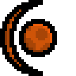
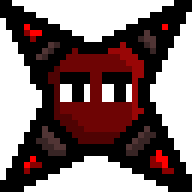
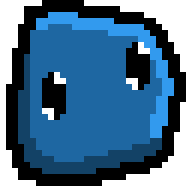
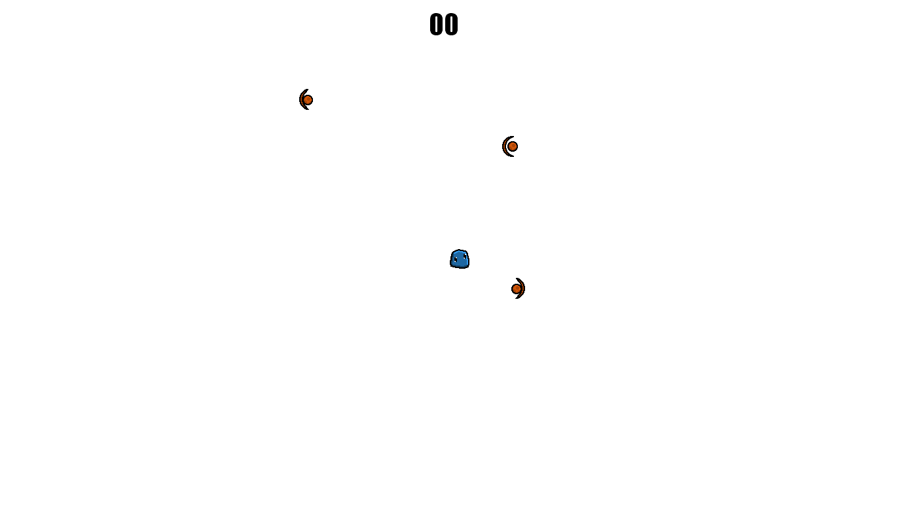
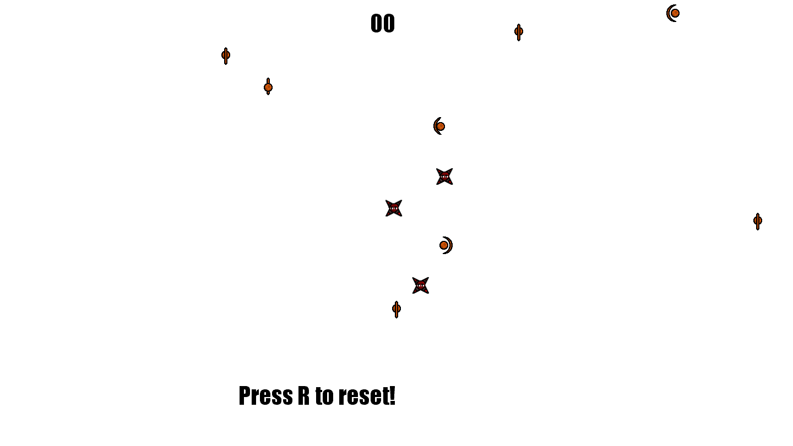
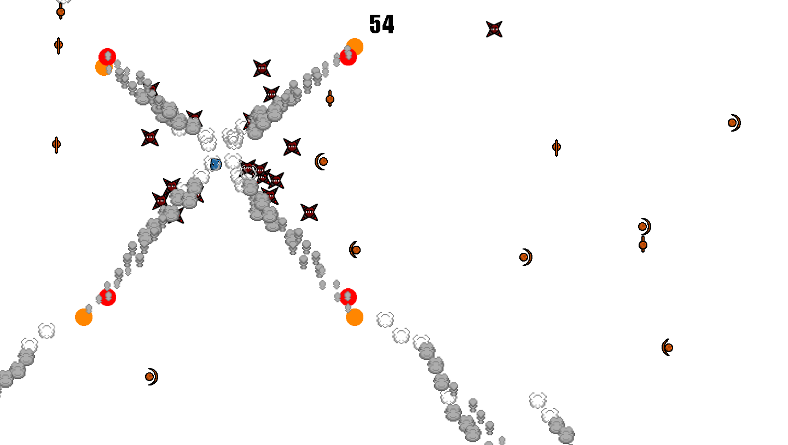
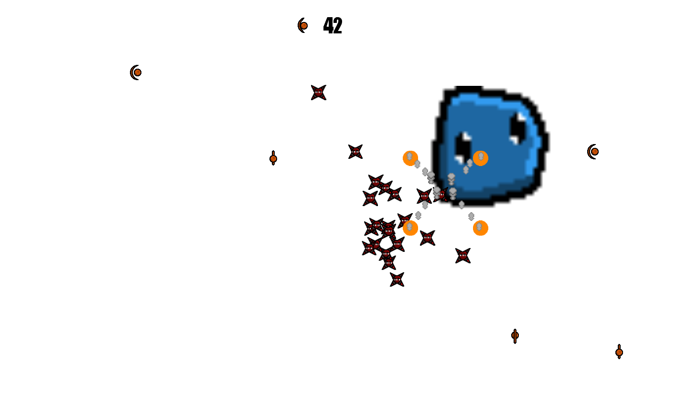



<!--============-->

<h1>

《SLIME LAB》

</h1>

<b>SlimeLab</b> is a TopDown 2D action-adventure game, where the player controls a small blue Slime that must eat small asteroid cells while running away from pursuing spikes.

 

 

 

<i>This game was made as a way of learning! It uses in its construction the Game Creation Framework known as <a href="https://www.monogame.net">Monogame</a>.</i>

<i>Because this project is for studies, it is not following good coding or Designer practices, do not use this game as an example for yours!</i>

 
 

 

<h1>🎮 《 CONTROLS 》 🎮</h1>

<b>▸ Move:</b> <code>W/A/S/D</code>

<b>▸ Exit:</b> <code>ESC</code>

<b>▸ Restart:</b> <code>R</code>

<h1>🖼 《 PICTURES 》 🖼</h1>

<!--============-->

